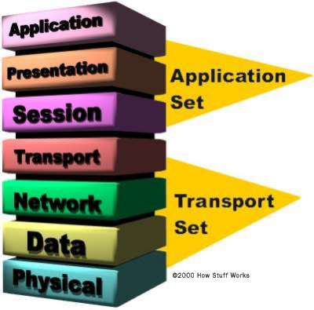

# OSI MODEL

## The Layers

Think of the seven layers as the assembly line in the computer. At each layer, certain things happen to the data that prepare it for the next layer. The seven layers, which separate into two sets, are:

## Application Set

**Layer 7: Application** - This is the layer that actually interacts with the operating system or application whenever the user chooses to transfer files, read messages or perform other network-related activities.

**Layer 6:Presentation** - Layer 6 takes the data provided by the Application layer and converts it into a standard format that the other layers can understand.

**Layer 5: Session** - Layer 5 establishes, maintains and ends communication with the receiving device.

## Transport Set

**Layer 4: Transport** - This layer maintains flow control of data and provides for error checking and recovery of data between the devices. Flow control means that the Transport layer looks to see if data is coming from more than one application and integrates each application's data into a single stream for the physical network.

**Layer 3: Network** - The way that the data will be sent to the recipient device is determined in this layer. Logical protocols, routing and addressing are handled here.

**Layer 2: Data** - In this layer, the appropriate physical protocol is assigned to the data. Also, the type of network and the packet sequencing is defined.

**Layer 1: Physical** - This is the level of the actual hardware. It defines the physical characteristics of the network such as connections, voltage levels and timing. The OSI Reference Model is really just a guideline. Actual protocol stacks often combine one or more of the OSI layers into a single layer.

## Protocol Stacks

A protocol stack is a group of protocols that all work together to allow software or hardware to perform a function. The TCP/IP protocol stack is a good example. It uses four layers that map to the OSI model as follows:

**Layer 1: Network Interface** - This layer combines the Physical and Data layers and routes the data between devices on the same network. It also manages the exchange of data between the network and other devices.

**Layer 2: Internet** - This layer corresponds to the Network layer. The Internet Protocol \(IP\) uses the IP address, consisting of a Network Identifier and a Host Identifier, to determine the address of the device it is communicating with.

**Layer 3: Transport** - Corresponding to the OSI Transport layer, this is the part of the protocol stack where the Transport Control Protocol \(TCP\) can be found. TCP works by asking another device on the network if it is willing to accept information from the local device.

**Layer 4: Application** - Layer 4 combines the Session, Presentation and Application layers of the OSI model. Protocols for specific functions such as e-mail \(Simple Mail Transfer Protocol, SMTP\) and file transfer \(File Transfer Protocol, FTP\) reside at this level.

As you can see, it is not necessary to develop a separate layer for each and every function outlined in the OSI Reference Model. But developers are able to ensure that a certain level of compatibility is maintained by following the general guidelines provided by the model.

