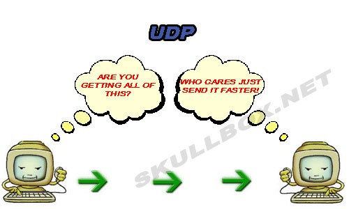
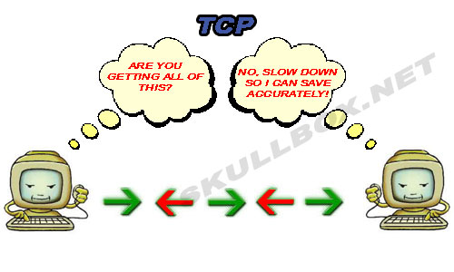
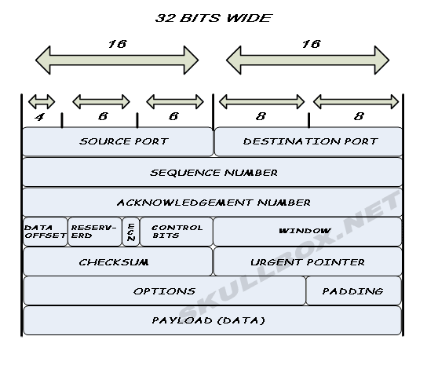
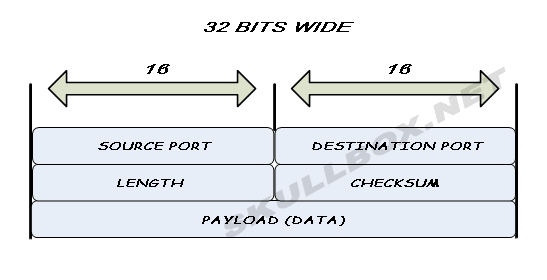

# What is the difference between UDP and TCP internet protocols?

Transmission Control Protocol \(TCP\) and User Datagram Protocol \(UDP\)is a transportation protocol that is one of the core protocols of the Internet protocol suite. Both TCP and UDP work at transport layer TCP/IP model and both have very different usage.

## Difference between TCP and UDP

| TCP | UDP |
| :--- | :--- |
| Reliability: TCP is connection-oriented protocol. When a file or message send it will get delivered unless connections fails. If connection lost, the server will request the lost part. There is no corruption while transferring a message. | Reliability: UDP is connectionless protocol. When you a send a data or message, you don't know if it'll get there, it could get lost on the way. There may be corruption while transferring a message. |
| Ordered: If you send two messages along a connection, one after the other, you know the first message will get there first. You don't have to worry about data arriving in the wrong order. | Ordered: If you send two messages out, you don't know what order they'll arrive in i.e. no ordered |
| Heavyweight: - when the low level parts of the TCP "stream" arrive in the wrong order, resend requests have to be sent, and all the out of sequence parts have to be put back together, so requires a bit of work to piece together. | Lightweight: No ordering of messages, no tracking connections, etc. It's just fire and forget! This means it's a lot quicker, and the network card / OS have to do very little work to translate the data back from the packets. |
| Streaming: Data is read as a "stream," with nothing distinguishing where one packet ends and another begins. There may be multiple packets per read call. | Datagrams: Packets are sent individually and are guaranteed to be whole if they arrive. One packet per one read call. |
| Examples: World Wide Web \(Apache TCP port 80\), e-mail \(SMTP TCP port 25 Postfix MTA\), File Transfer Protocol \(FTP port 21\) and Secure Shell \(OpenSSH port 22\) etc. | Examples: Domain Name System \(DNS UDP port 53\), streaming media applications such as IPTV or movies, Voice over IP \(VoIP\), Trivial File Transfer Protocol \(TFTP\) and online multiplayer games etc |

## Overview

**TCP** \(Transmission Control Protocol\) is the most commonly used protocol on the Internet. The reason for this is because TCP offers error correction. When the TCP protocol is used there is a "guaranteed delivery." This is due largely in part to a method called "flow control." Flow control determines when data needs to be re-sent, and stops the flow of data until previous packets are successfully transferred. This works because if a packet of data is sent, a collision may occur. When this happens, the client re-requests the packet from the server until the whole packet is complete and is identical to its original.

**UDP** \(User Datagram Protocol\) is anther commonly used protocol on the Internet. However, UDP is never used to send important data such as webpages, database information, etc; UDP is commonly used for streaming audio and video. Streaming media such as Windows Media audio files \(.WMA\) , Real Player \(.RM\), and others use UDP because it offers speed! The reason UDP is faster than TCP is because there is no form of flow control or error correction. The data sent over the Internet is affected by collisions, and errors will be present. Remember that UDP is only concerned with speed. This is the main reason why streaming media is not high quality.

On the contrary, UDP has been implemented among some trojan horse viruses. Hackers develop scripts and trojans to run over UDP in order to mask their activities. UDP packets are also used in DoS \(Denial of Service\) attacks. It is important to know the difference between TCP port 80 and UDP port 80. If you don't know what ports are go here.

## Frame Structure

As data moves along a network, various attributes are added to the file to create a frame. This process is called encapsulation. There are different methods of encapsulation depending on which protocol and topology are being used. As a result, the frame structure of these packets differ as well. The images below show both the TCP and UDP frame structures.

### TCP FRAME STRUCTURE

### UDP FRAME STRUCTURE

The payload field contains the actually data. Notice that TCP has a more complex frame structure. This is largely due to the fact the TCP is a connection-oriented protocol. The extra fields are need to ensure the "guaranteed delivery" offered by TCP.

